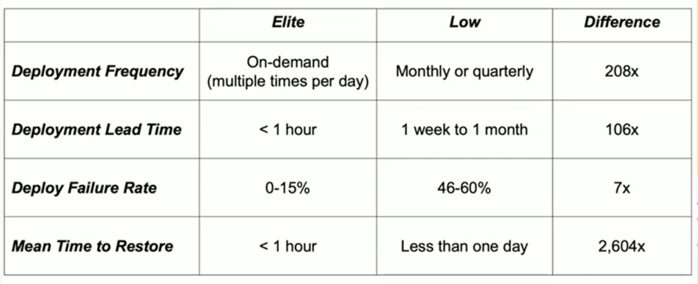

## 1. What does DevOps mean for large organisations?
### Speakers: 
- **Gene Kim**, bestselling author and multiple-award winning Chief Technology Officer
- **Rodrigo Castillo**, Chief Technology Officer at CBA

### The unicorn project 
The business value of DevOps is even higher than we thought

### Elite vs low performers

### The Five Ideals
The unicorn project - business value of DevOps is even higher than we thought
1. Locality and Simplicity
    * To get something done, how many people/levels you have to talk to? -> as less as possible
2. Focus, Flow, and Joy
    * The value of platform team
    * Ask quesiton - to what degree do we fear of doing a deploymenbt?
3. Improvement of Daily Work
    * The need to pay down technical debt
4. Psychological Safety
5. Customer Focus

## 2. What role does AI play in the development lifecycle? How can engineers use AI to reduce toil? 
### Speakers: 
- **Ryan Salva**, Vice President of Product at GitHub
- **Cormac O'Mahony**, Distinguished Engineer at CBA

Demo of Ggithub Copilot

## 3. What Flow and Viz means for organisations working in agile
### Speakers: 
- **Mik Kersten**, CEO Tasktop Technologies
- **Tobias Byron**, Executive General Manager Strategy Performance
### Description:
You'll get the most value out of this session if you're unsure about how Pace and agile ways of working will help us deliver faster and safer for customers.

## 4. So, what does agile, flow, metrics and all this mean for non-technical teams working in agile organisations?
### Speakers: 
- **Dominica DeGrandis**, Principal Flow Advisor
- **Yvonne Richardson**, CoE Lead and Chapter Area Lead MCA Strategy Tech and Operations. Author of “Making Work Visible.”

## 5. What is it like to work in an Agile organisation?Mindset and behaviours 
### Speakers: 
- **Kevin Bryniak**, an Agile coaching and transformation expert from PA Consulting

### Agile transformation 
* from "doing" (scrum) to "being" (mindset unit)
* all about our collective mindset
* change the culture by moving from Me to We

## 6. From Project to Product - A new way of seeing, measuring and managing software delivery
### Speakers:  
- **Brendan Hopper**, Chief Technology Office at CBA
- **Alan Manuel**, GVP Product Management from Planview

## 7. The Dev Sec Ops revolution - A unique opportunity to hear from Gene Kim – one of the world's pre-eminent DevOps experts 
### Speakers:  
- **Gene Kim**, bestselling author and multiple-award winning Chief Technology Officer

## Links:
* https://commbank.sharepoint.com/sites/onecba-engineering/SitePages/DevSecOps-Symposium-2023.aspx